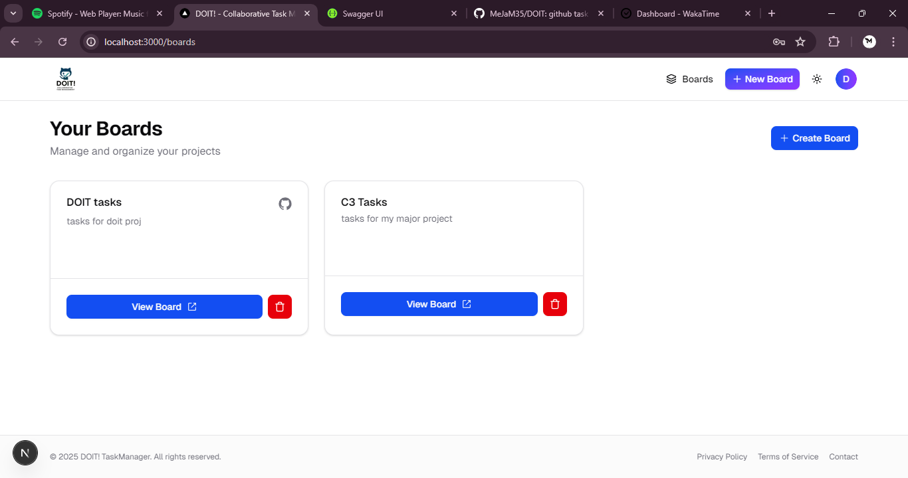
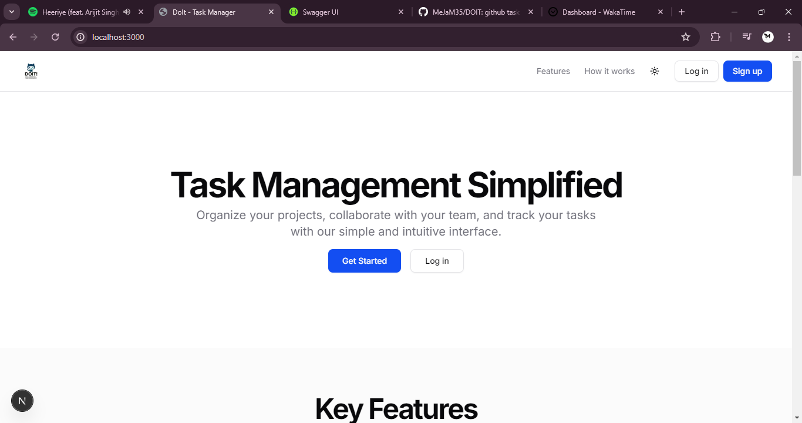
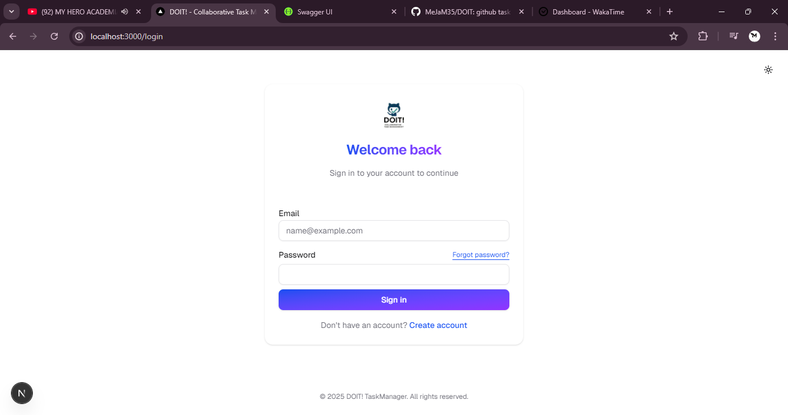
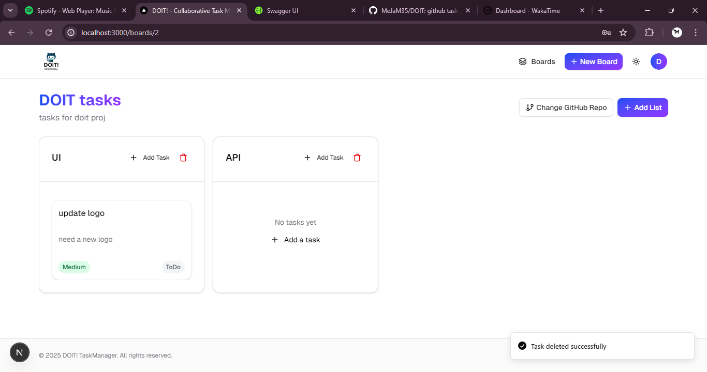

# DOIT! - Collaborative Task Management Application

A beautiful, modern task management application inspired by Trello, built with ASP.NET Core backend and Next.js frontend with shadcn/ui components.


<!-- Insert a banner screenshot of your application here -->

## Features

- **User Authentication**
  - JWT-based secure user registration and login
  - Clean, modern authentication UI


<!-- Insert screenshot of login/register screens here -->

- **Board Management**
  - Create multiple boards to organize different projects
  - Beautiful, responsive grid layout of boards
  - Each board can connect to a GitHub repository


<!-- Insert screenshot of boards dashboard here -->

- **List & Task Organization**
  - Trello-like horizontal scrolling lists
  - Create, update, and delete tasks within lists
  - Intuitive drag-and-drop interface (coming soon)
  - Move tasks between lists


<!-- Insert screenshot of a board with lists and tasks here -->

- **Task Details**
  - Title, description, due date
  - Priority levels with visual indicators (Low, Medium, High, Urgent)
  - Status tracking (ToDo, InProgress, Blocked, Done)
  - Clean modal interfaces for task creation and editing


<!-- Insert screenshot of task details view here -->

- **GitHub Integration**
  - Connect boards to GitHub repositories
  - Automatically close tasks based on commit messages
  - View recent commits from connected repositories

## Tech Stack

### Backend
- **Framework**: ASP.NET Core 8.0 Web API
- **Database**: SQLite (easy to switch to SQL Server)
- **Authentication**: JWT (JSON Web Tokens)
- **GitHub Integration**: Octokit
- **API Documentation**: Swagger/OpenAPI

### Frontend
- **Framework**: Next.js 15 with React 19
- **UI Components**: shadcn/ui
- **Styling**: Tailwind CSS 4
- **API Client**: Axios
- **State Management**: React hooks and context

## Getting Started

### Prerequisites

- .NET 8.0 SDK or later
- Node.js 16.x or later
- npm or yarn

### Installation

1. Clone this repository
   ```
   git clone https://github.com/YourUsername/DOIT-TaskManager.git
   cd DOIT-TaskManager
   ```

2. Build and run the backend
   ```
   cd TaskManager
   dotnet build
   dotnet run
   ```

3. Install frontend dependencies
   ```
   cd ClientApp
   npm install --legacy-peer-deps
   ```

4. Run the frontend development server
   ```
   npm run dev
   ```

5. Access the application
   ```
   Backend API: http://localhost:5103
   Frontend: http://localhost:3000
   Swagger API Docs: http://localhost:5103/swagger
   ```

### Database Setup

The application is configured to use SQLite by default, and will automatically create the database on first run. If you need to recreate the database:

```
cd TaskManager
dotnet ef database update
```

### GitHub Integration

To use GitHub integration features, add a GitHub personal access token to your `appsettings.json`:

```json
"GitHub": {
  "Token": "your_github_personal_access_token" 
}
```

## Architecture

The application follows a clean architecture pattern:

### Backend

- **Controllers**: Handle HTTP requests and responses
- **Services**: Contain business logic
- **Models**: Define the database entities
- **DTOs**: Objects used for data transfer between layers
- **Data**: Database context and configuration

### Frontend

- **Pages**: Next.js pages for routing
- **Components**: Reusable UI components
- **Services**: API clients for communicating with the backend
- **Utils**: Helper functions and utilities

## API Endpoints

### Authentication
- `POST /api/auth/register` - Register a new user
- `POST /api/auth/login` - Login and receive JWT token

### Boards
- `GET /api/boards` - Get all boards
- `GET /api/boards/{id}` - Get a specific board
- `POST /api/boards` - Create a new board
- `PUT /api/boards/{id}` - Update a board
- `DELETE /api/boards/{id}` - Delete a board
- `POST /api/boards/{id}/connect-github` - Connect a GitHub repository
- `GET /api/boards/{id}/github-commits` - Get commits from connected repository

### Lists
- `GET /api/boards/{boardId}/lists` - Get all lists for a board
- `GET /api/boards/{boardId}/lists/{id}` - Get a specific list
- `POST /api/boards/{boardId}/lists` - Create a new list
- `PUT /api/boards/{boardId}/lists/{id}` - Update a list
- `DELETE /api/boards/{boardId}/lists/{id}` - Delete a list

### Tasks
- `GET /api/lists/{listId}/tasks` - Get all tasks for a list
- `GET /api/lists/{listId}/tasks/{id}` - Get a specific task
- `POST /api/lists/{listId}/tasks` - Create a new task
- `PUT /api/lists/{listId}/tasks/{id}` - Update a task
- `DELETE /api/lists/{listId}/tasks/{id}` - Delete a task
- `POST /api/lists/{listId}/tasks/{id}/move` - Move a task to another list

## Security Considerations

- JWT secret key should be kept secure and not committed to source control
- GitHub personal access tokens should be managed securely

## Roadmap

- Drag and drop task management
- Dark mode toggle
- User profile management
- Team collaboration features
- GitHub issue integration
- Real-time updates with SignalR

## Screenshots

### Landing Page

<!-- Insert login page screenshot here -->

### Login Page

<!-- Insert login page screenshot here -->

### Board View with Lists and Tasks

<!-- Insert board view screenshot here -->

### Tasks

<!-- Insert task creation screenshot here -->

## License

[MIT License](LICENSE)

## Acknowledgments

- shadcn/ui for beautiful, accessible components
- Next.js team for an amazing React framework
- ASP.NET Core team for a robust backend framework