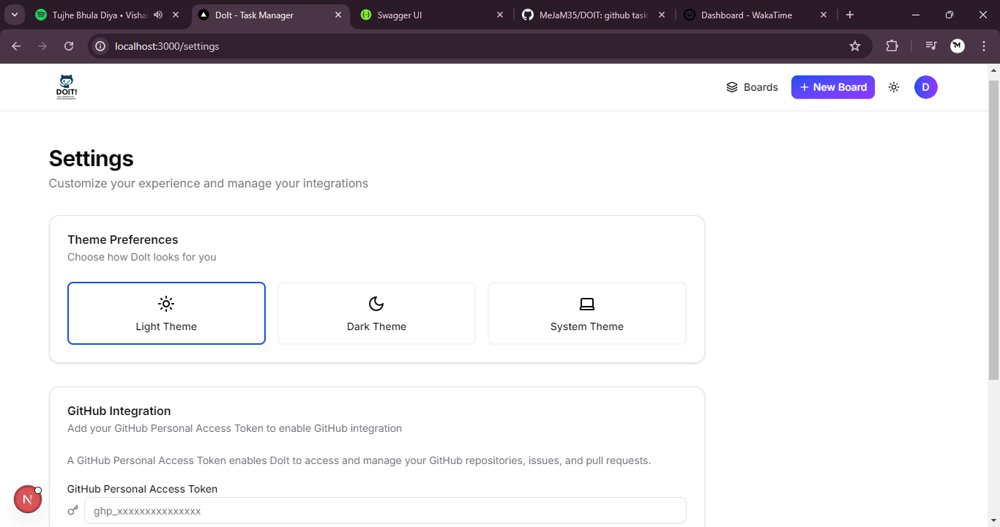

# DOIT! - Collaborative Task Management Application

A modern task management application inspired by Trello with ASP.NET Core backend and Next.js frontend.

## Features

- **User Authentication**: Secure JWT-based authentication
- **Board Management**: Organize projects with multiple boards
- **List & Task Organization**: Create and manage tasks within customizable lists
- **GitHub Integration**: Connect boards to repositories and sync with commits

## Application Screenshots

### Landing Page


### Login Screen


### Boards Overview


### Task Management


### User Profile


### Settings


## Tech Stack

**Backend**: ASP.NET Core 8.0, SQLite, JWT Authentication  
**Frontend**: Next.js 15, React 19, shadcn/ui, Tailwind CSS 4

## Quick Start

### Prerequisites
- .NET 8.0 SDK
- Node.js 16.x+
- npm or yarn

### Setup

1. **Backend**
   ```
   cd TaskManager
   dotnet build
   dotnet run
   ```

2. **Frontend**
   ```
   cd TaskManager/ClientApp
   npm install
   npm run dev
   ```

3. **Access**
   - Web App: http://localhost:3000
   - API: http://localhost:5103
   - Docs: http://localhost:5103/swagger

### GitHub Integration

Add a GitHub personal access token to your `appsettings.json`:
```json
"GitHub": {
  "Token": "your_github_personal_access_token" 
}
```